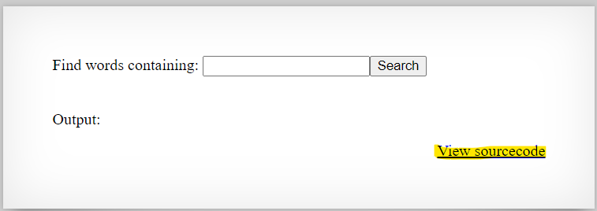
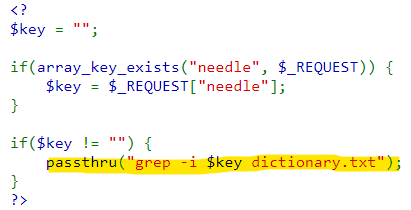
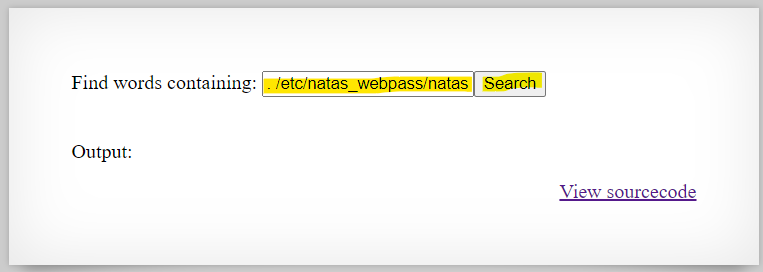
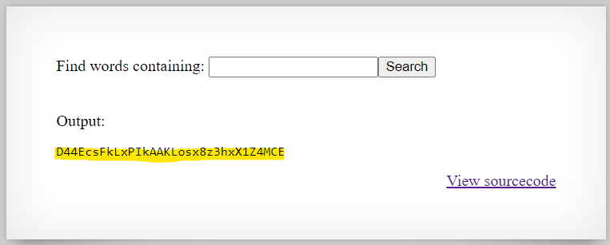

# Level 8 → Level 9

## Details
Username: `natas9`<br />
Password: `Sda6t0vkOPkM8YeOZkAGVhFoaplvlJFd`<br />
URL:      http://natas9.natas.labs.overthewire.org

## Solution
</img>

</img>

Let's hack the command. We know that the password for step 10 is in **/etc/natas_webpass/natas10**, and there is access to it from step 9. Therefore, we will enter an input that will cause the file to be printed like this: `. /etc/natas_webpass/natas10 #`

</img>

</img>

## Password for the next level:
```
D44EcsFkLxPIkAAKLosx8z3hxX1Z4MCE
```
